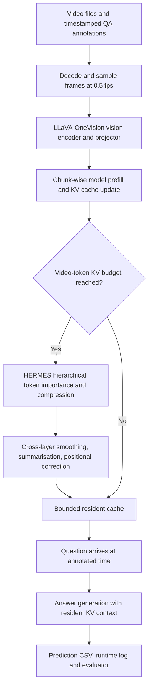

# HERMES Reproduction: Technical Audit, Evidence Assessment, and Next Research Plan

**Document type:** Research audit and forward plan  
**Prepared:** 9 October 2026  
**Project:** Training-free hierarchical KV-cache memory for streaming video question answering  
**Current implementation:** HERMES + LLaVA-OneVision-Qwen2-0.5B on Kaggle Tesla T4  
**Evidence cutoff:** The uploaded research log (last updated 24 September 2026), uploaded Kaggle notebook, and previously supplied HERMES paper  
**Assessment status:** **Successful reported pilot and scaled subset; full reproduction fidelity and generalisation not yet established**

> **Scope and evidence rule.** This audit examines the uploaded `HERMES_reproduction_project_log_updated.md` and `harmes-redep (4)(1).ipynb`, and uses the previously provided HERMES research paper for methodological context. It distinguishes (a) statements documented in the log, (b) notebook code and saved cell outputs, (c) independent interpretation, and (d) checks impossible without the original Kaggle CSV/log/source archive. No GPU inference was rerun in preparing this report. All accuracy, memory and latency values below are **reported experimental outputs**, not newly replicated measurements.

---

## Contents

1. [Executive assessment](#1-executive-assessment)
2. [Source materials, completeness, and evidence grades](#2-source-materials-completeness-and-evidence-grades)
3. [Research objective and original HERMES context](#3-research-objective-and-original-hermes-context)
4. [Full development and experiment chronology](#4-full-development-and-experiment-chronology)
5. [Technical implementation and code-path review](#5-technical-implementation-and-code-path-review)
6. [Environment and reproducibility assessment](#6-environment-and-reproducibility-assessment)
7. [Dataset construction and representativeness](#7-dataset-construction-and-representativeness)
8. [Quantitative results: the complete experimental record](#8-quantitative-results-the-complete-experimental-record)
9. [Statistical validity and question-level pairing](#9-statistical-validity-and-question-level-pairing)
10. [Error analysis and mechanisms](#10-error-analysis-and-mechanisms)
11. [Risks, inconsistencies, and unresolved verification](#11-risks-inconsistencies-and-unresolved-verification)
12. [Prioritised next-stage research plan](#12-prioritised-next-stage-research-plan)
13. [Experimental design specification](#13-experimental-design-specification)
14. [Executable analysis template](#14-executable-analysis-template)
15. [Candidate research extensions and novelty boundaries](#15-candidate-research-extensions-and-novelty-boundaries)
16. [Deliverables, decision gates, and completion criteria](#16-deliverables-decision-gates-and-completion-criteria)
17. [Source map and asset requirements](#17-source-map-and-asset-requirements)
18. [Final assessment](#18-final-assessment)

---

## 1. Executive assessment

**Main finding.** On a documented **50-video / 250-question** subset, HERMES with 4,000 or 6,000 cache-budgeted tokens answered **143/250 questions correctly (57.2%)**, while a **50,000-token HERMES control** answered **138/250 (55.2%)**. The 4K and 6K settings used much less reported GPU memory and had lower query-time *time to first token* (TTFT). These observations support a **promising efficiency-versus-accuracy trade-off on this particular subset**. They do not yet establish that HERMES is more accurate than the original LLaVA model, or that 4K is universally optimal.

| Configuration | Correct | Accuracy | 95% Wilson interval* | Highest logged GPU memory | Median logged TTFT | P95 TTFT | Maximum logged answering-cache length | Logged compression events |
|---|---:|---:|---:|---:|---:|---:|---:|---:|
| HERMES, KV=4,000 | 143/250 | **57.2%** | 51.00–63.18% | **4.729 GB** | **0.058 s** | 0.068 s | 4,013 | 770 |
| HERMES, KV=6,000 | 143/250 | **57.2%** | 51.00–63.18% | 4.796 GB | 0.060 s | **0.066 s** | 6,013 | 732 |
| Large-budget HERMES control, KV=50,000 | 138/250 | 55.2% | 49.00–61.24% | 11.872 GB | 0.112 s | 0.217 s | 50,013 | 79 |

*The saved Wilson calculations treat 250 questions as independent Bernoulli trials; because there are five questions per video, these intervals are descriptive and may understate uncertainty when question outcomes cluster within videos. See Section 9.*

**Measured trade-off against the 50K control, as reported:** 4K has **60.2% lower highest logged GPU memory**, **48.2% lower median TTFT**, and **92.0% fewer cache positions at the logged maximum**, with a **+2.0 percentage-point observed accuracy difference**. The accuracy difference is a point estimate, **not** a demonstrated causal or statistically reliable improvement. KV=50K is not the original non-HERMES model and was itself compressed on the larger run.

**The four most important next tasks are:**

1. **Resolve source-code fidelity**, especially the tracked modification to `video_qa/base.py` revealed by saved `git status`.
2. **Perform full 250-question paired analysis** rather than infer equivalence from equal aggregate accuracy or overlapping Wilson intervals.
3. **Run an actual non-HERMES LLaVA-OneVision-0.5B control** with a precisely matched frame/question protocol and honest hardware limitations.
4. **Expand from a single non-random 50-video shard to broader, better-balanced evaluation**, then full StreamingBench if the earlier gates pass.

**Verdict:** This is substantive engineering and empirical progress, but best described as a **successful subset reproduction and systems study**, not yet a fully audited reproduction of every result or component in the HERMES paper.

---

## 2. Source materials, completeness, and evidence grades

### 2.1 Materials directly inspected

| Asset | Observed contents | What it establishes | What it cannot establish alone |
|---|---|---|---|
| `HERMES_reproduction_project_log_updated.md` | Structured project record with 17 numbered sections, results tables, development notes, external figure references and next steps | Researcher-reported workflow, configurations, interpretation, completed work | Cannot independently prove saved CSV values or active Kaggle source state |
| `harmes-redep (4)(1).ipynb` | **191 cells: 166 code and 25 markdown**; extensive saved execution outputs, commands, analysis and backup workflow | Actual notebook procedures and reported outputs, selected Git status, environment versions, summary tables | Is not a self-contained executable repo, model checkpoint, dataset or full collection of CSV and log files |
| `HERMES_arxiv.pdf` (previously uploaded) | Original HERMES method, tables, experiments, formulas and appendices | Research-paper methodology and the distinction between true model baselines and cache-managed variants | Does not validate the Kaggle implementation or the local subset scores |

**Evidence grading used throughout:**

- **A — Notebook directly corroborated:** executable cell contents or explicit saved output show the fact.
- **B — Research-log reported:** present in project log and consistent with notebook summaries, but raw underlying assets not available for independent recalculation.
- **C — Analytic interpretation:** reasoned inference from A/B, not a directly measured experimental outcome.
- **D — Unverified / requiring further artifact or test:** must not be reported as established.

### 2.2 Important missing artifacts

The project log records two successful ZIP integrity checks (144-file research archive; 445-file full Kaggle directory archive), but **neither ZIP is among the two latest uploads**. The notebook references files beneath `/kaggle/working/HERMES/`, not actually mounted here, such as all `results/.../1_0.csv`, `streamingbench_50_kv*.log`, `git_status.txt`, `source_changes.diff`, `pip_freeze.txt`, and figure PNGs. Therefore I examined code **and stored outputs**, not independently replayed those raw results. The notebook also has an unusual state in which several cells contain saved outputs while their `execution_count` is null; this does **not** automatically mean they never ran, but it supports rerunning a clean reproducibility notebook rather than relying on historical cell ordering.

### 2.3 Asset priority to supply next

1. `source_changes.diff` and `video_qa/base.py` from the **actual experiment commit/worktree**.
2. All three 50-video `1_0.csv` files, the three complete `.log` files, and `streamingbench_50_kaggle.json`.
3. The six 10-video CSVs/logs and `kv_budget_pairwise_mcnemar_10video.csv`.
4. `environment.json`, `pip_freeze.txt`, `git_commit.txt`, `git_status.txt` and the SHA-256 manifest.
5. The full research ZIP or full Kaggle ZIP if individual items are inconvenient, plus figures for rebuilding a publication-quality results section.

---

## 3. Research objective and original HERMES context

The project's objective is to reproduce HERMES's **training-free streaming-video question-answering** workflow and study the effect of KV-cache budget on accuracy, latency, and memory in resource-constrained Kaggle inference. Six questions in the log focus on successful compression, budget dependence, memory saved, latency, task sensitivity, and statistical confidence, with a seventh covering small-subset representativeness.

The **original HERMES architecture** involves three layer-dependent retention regimes: shallow-layer recency, middle-layer mixed recency/attention, and deep-layer attention-selected long-term context. It also uses cross-layer memory smoothing, summary-token aggregation, and positional re-indexing/rotary-key correction. A faithful implementation must retain these mechanics. The log's smoke test supports cache-trigger execution and restoration of key code paths, but **does not separately isolate or quantify every architectural component**. Tests for these are proposed in Section 13.

**Terminology:** KV budget here refers to video-token-related cache allocation plus a fixed initial/static prefix. The observed `n_init = 13` explains cache sizes such as **4,013** when `kv_size = 4,000`. Query-time TTFT must not be mistaken for total live-video ingestion throughput, complete wall-clock QA latency, or sustainable processing of every source frame.

### System picture



This illustrates the **intended** architecture, not an independently inspected line-by-line reconstruction of the full upstream repository.

---

## 4. Full development and experiment chronology

The log records a seven-stage/day progression rather than dates for every individual milestone.

| Stage | Work completed | Substantiation and caveats |
|---|---|---|
| Day 1 | Kaggle T4 environment, Torch CUDA, LLaVA-OneVision-Qwen2-0.5B loading | Notebook setup/model smoke-test output (A) |
| Day 2 | Newer Transformers API and Qwen2 rotary incompatibility debugging; one-GPU strategy; pinned revision | Notebook install/direct Git commit verification, patch cells and code (A) |
| Day 3 | 113-second sandwich-preparation video, three timestamped QA prompts | Notebook sampling/annotation and model output (A); not a quantitative accuracy benchmark |
| Day 4 | Restore official `llavaov_hermes.py` and `reindex_1d.py`; 500-token faithful smoke test; build initial 10-video StreamingBench | Restore command and successful smoke-test outputs (A); other tracked source modification remains (D) |
| Day 5 | Six-budget pilot: 500, 1K, 2K, 4K, 6K, 50K | All six CSV inventories and budget-summary outputs (A/B) |
| Day 6 | 50 videos / 250 questions, 4K/6K/50K | Code/outputs show 250 rows and 50 unique videos per run (A) |
| Day 7 | Snapshot, environment metadata, code diff, hashes, ZIP integrity checks | Notebook reports 144-file backup PASS and 445-file full working-directory ZIP PASS (A); archived contents not uploaded here |

### Debugging evolution and why it matters

Earlier cells explored compatibility patches in `inference/reindex_1d.py` and `inference/llavaov_hermes.py`, including a temporary workaround disabling normal key re-rotation. Notebook cell **61** executes `git checkout HEAD -- inference/llavaov_hermes.py inference/reindex_1d.py`; cell **65** then runs the restored smoke test with `--kv_size 500`. This improves confidence that the *two restored inference files* were no longer using the debug shortcut before the benchmark. However, the later Git status (notebook cell **173**) still lists **`M video_qa/base.py`**, which needs an explicit semantic diff before claiming an exactly upstream-faithful pipeline. The mere act of saving the diff does not prove that it is harmless.

Some older exploratory notebook sections label 50K as a “Baseline” or “No Compression.” The **updated log correctly revises this** to **large-budget HERMES control**, because the 50-video run logged **79 compression events**. Use the corrected label everywhere going forward.

---

## 5. Technical implementation and code-path review

### 5.1 Model and environment controls

- Backbone: `llava-hf/llava-onevision-qwen2-0.5b-ov-hf`.
- HERMES repository origin: `https://github.com/haowei-freesky/HERMES`.
- Repository HEAD recorded: `8d699b16a6bedb9086c1b39ec4253c6a1d1ce789`.
- Transformers pinned from Git: `66bc4def9505fa7c7fe4aa7a248c34a026bb552b`; notebook installed commit matches expected.
- CPU/GPU: Python 3.12.13, PyTorch 2.10.0+cu128, Transformers 4.45.0.dev0, tokenizers 0.19.1; experimental process selects one Tesla T4 with `CUDA_VISIBLE_DEVICES=0`.
- Frame sampling: **0.5 fps**, via `--sample_fps 0.5`.
- Streaming inference enabled with `--streaming true`.
- Benchmarks run using `python -m video_qa.hermes_vqa`, `--model llava_ov_0.5b`, `--anno_path ...`, `--kv_size ...`, and `--num_chunks 1 --chunk_idx 0`.

### 5.2 Documented execution pattern

```bash
CUDA_VISIBLE_DEVICES=0 python -m video_qa.hermes_vqa \
  --model llava_ov_0.5b \
  --sample_fps 0.5 \
  --save_dir results/streamingbench_50_kv4000 \
  --anno_path data/streamingbench_50_kaggle.json \
  --debug false \
  --num_chunks 1 \
  --chunk_idx 0 \
  --kv_size 4000 \
  --streaming true
```

This is a **recorded Kaggle run configuration**, not a command executed in this audit environment. The 6K and 50K runs change the result directory and `--kv_size` only.

### 5.3 Correctly working subsystems according to saved outputs

- The model loads on CUDA and generates responses.
- Timestamped videos can be processed in chunks.
- KV compression appears in logs when budgets are exceeded.
- Cache maxima conform to the budget plus observed 13-token prefix.
- 50-video batches produce all 250 expected result rows.
- The notebook extracts multiple-choice `qa_acc`, task classifications, runtime measurements and figures.
- There are recorded complete benchmark inventories and integrity-checked archives.

### 5.4 Not yet proven from these uploads

- The exact semantics of the modification to `video_qa/base.py`.
- Equivalence of the final full repository tree to official HERMES except for justified data loading and logging changes.
- Unit tests of **layer partitioning, pseudo-query attention scoring, cross-layer smoothing, summary pooling and rotary delta correction** in isolation.
- Exact definition of memory and TTFT instrumentation within inference code. The analysis function parses literal strings `GPU memory usage: ... GB` and `TTFT: ... seconds`; these are **logged measurements**, not necessarily CUDA's global peak-reserved allocation or end-to-end video throughput.
- Numerical robustness of predictions across fresh clean restarts/hardware configurations.
- Separation of conversation history from gold labels for all benchmark calls: verify in source that model guidance uses prior **predicted** responses, never current/future reference answers.

---

## 6. Environment and reproducibility assessment

| Parameter | Saved value |
|---|---|
| Kaggle GPU visibility | 2 × Tesla T4 listed by machine, experiment constrained to 1 |
| Experimental accelerator | One Tesla T4 |
| Python | 3.12.13 |
| PyTorch | 2.10.0+cu128 |
| Transformers | 4.45.0.dev0 |
| `tokenizers` | 0.19.1 |
| HERMES branch | `main` |
| HERMES revision | `8d699b16a6bedb9086c1b39ec4253c6a1d1ce789` |
| Transformers source revision | `66bc4def9505fa7c7fe4aa7a248c34a026bb552b` |
| Precision and generation details | Obtain from actual effective config/source and logs rather than assume all values match the original paper |
| Logged model seed | `seed: 2024` appears in 50-video inference logs |

**Reproducibility strengths:** pinning the Transformers Git SHA instead of an ambiguous version label, storing repository revision and status, saving package versions, recording raw inference logs, preserving output CSVs, and SHA-256 manifest creation.

**Reproducibility weaknesses:** notebook has iterative/debugging cells, repeat-clone attempts, in-place source edits, persisted state across cells, absolute Kaggle paths, and conditional “skip if a nonempty result file exists” logic. A nonempty CSV could be incomplete. Validate row and key coverage before accepting an existing run. A separate **clean-room reproduction notebook or script** should become the canonical experiment driver.

**Trust gate:** inspect `source_changes.diff` and `video_qa/base.py` before endorsing the word “faithful”; archive the *exact executed checkout and config*, not merely the HEAD SHA.

---

## 7. Dataset construction and representativeness

### 7.1 Dataset and matching

The notebook loads **498 annotation records** from `data/streamingbench/streamingbench_realtime.json`. It extracts a specific downloadable shard located under `/kaggle/working/streamingbench_201_250` and matches 50 actual video files to annotations through `sample_<number>_real.mp4` → `sample_<number>/video.mp4`. It excludes macOS metadata files beginning with `._`, checks that no paths are missing, and writes `streamingbench_50_kaggle.json`.

**Key consequence:** this is a **convenience shard**, not a random or demonstrably representative sample of the full official benchmark. It is suitable for engineering checks and preliminary paired experiments, but full-benchmark generalisation requires broader sampling. The initial 10 videos are also drawn from this limited available-material workflow; confirm overlap and exact IDs before treating 10- versus 50-video comparisons as independent validation.

### 7.2 Scaled sample characteristics

| Statistic | Reported value |
|---|---:|
| Videos | 50 |
| Questions | 250 |
| Questions/video | 5 |
| Minimum video duration | 200.17 s |
| Mean video duration | 543.54 s |
| Median video duration | 614.09 s |
| Maximum video duration | 847.61 s |
| Nominal sampled frame rate | 0.5 fps |

Nominally 0.5 fps is one sampled video frame about every two seconds. Performance on small, short-lived visual events therefore depends on *frame acquisition* as well as memory selection; a missed event cannot be recovered by a more sophisticated cache if it was never sampled.

### 7.3 Task distribution: imbalanced

| Task | Questions | Share |
|---|---:|---:|
| Causal Reasoning | 101 | 40.4% |
| Prospective Reasoning | 100 | 40.0% |
| Event Understanding | 16 | 6.4% |
| Action Recognition | 9 | 3.6% |
| Attribute Recognition | 9 | 3.6% |
| Object Recognition | 5 | 2.0% |
| Counting | 5 | 2.0% |
| Spatial Understanding | 3 | 1.2% |
| Text-Rich Understanding | 2 | 0.8% |
| **Total** | **250** | **100%** |

**Interpretation:** Causal + Prospective Reasoning supply **201/250 questions = 80.4%**. The overall score is not a balanced summary of visual abilities. Even a large difference on a five-question task would have low precision and small influence on total accuracy. Report both overall micro accuracy and per-task/sample-size details, plus balanced macro-task accuracy only with clear warnings about tiny groups.

---

## 8. Quantitative results: the complete experimental record

### 8.1 Custom-video KV-compression smoke test

| Budget | Compression triggered? | Maximum/final reported cache | Approx. logged GPU memory | Interpretation |
|---:|---|---:|---:|---|
| 500 | Yes | 513 | 4.43–4.62 GB | Strong compression; prefix accounts for additional 13 positions |
| 4,000 | Yes | 4,013 | ~4.52 GB | Budgeted cache works |
| 50,000 | No (on this *short* smoke test) | Not specified in the log table | ~4.58 GB | No-trigger **for this test only** |

The notebook reports a 113.18-second / 3,392-source-frame sandwich video and three question prompts. These examples demonstrate functionality; they do not measure benchmark accuracy because no verified ground-truth scoring was provided for the custom prompts.

### 8.2 Complete 10-video, 50-question budget ablation

| KV budget | Accuracy | 95% Wilson interval | Maximum logged GPU memory | Median TTFT | P95 TTFT | Maximum cache length | Compression log events |
|---:|---:|---|---:|---:|---:|---:|---:|
| 500 | **68.0%** | 54.19–79.24% | 4.624 GB | 0.060 s | 0.064 s | 513 | 89 |
| 1,000 | **68.0%** | 54.19–79.24% | 4.641 GB | 0.059 s | 0.065 s | 1,013 | 87 |
| 2,000 | 60.0% | 46.18–72.39% | 4.665 GB | 0.060 s | 0.065 s | 2,013 | 79 |
| 4,000 | 56.0% | 42.31–68.84% | 4.709 GB | 0.063 s | 0.075 s | 4,013 | 76 |
| 6,000 | 56.0% | 42.31–68.84% | 4.779 GB | 0.063 s | 0.077 s | 6,013 | 67 |
| 50,000 | 52.0% | 38.51–65.20% | 6.650 GB | 0.074 s | 0.120 s | 30,981 | 0 |

**What this actually shows:** accuracy did not increase monotonically with the cache budget on this small sample. KV=500 and KV=1K did well in the 50 recorded questions, but extrapolating this to the full population would be unjustified. Unlike the 50-video run, the 50K configuration did not compress here, so its role changes with video duration and total token accumulation.

### 8.3 Scaled 50-video experiment

Reproduced in Section 1. Three budgets, all on the same 50 videos/250 questions. Compare to the 50K HERMES control only; **not** to non-HERMES LLaVA or to published full-benchmark accuracy as if protocols were identical.

| Comparison | 4K against 50K | 6K against 50K |
|---|---:|---:|
| Observed accuracy difference | +2.0 percentage points | +2.0 percentage points |
| Relative reduction in maximum logged GPU memory | 60.2% | 59.6% |
| Relative reduction in median logged TTFT | 48.2% | 46.4% |
| Maximum answering-cache length | 4,013 vs 50,013 | 6,013 vs 50,013 |
| Control compression events | 79 | 79 |

Equal 4K/6K *aggregate* accuracy does **not** necessarily imply identical predictions. The 10-video exact paired table records **zero disagreements** between 4K and 6K there; check the 50-video pair separately.

### 8.4 Per-task 50-video results

| Task | N | KV=4K | KV=6K | KV=50K |
|---|---:|---:|---:|---:|
| Action Recognition | 9 | 55.56% | 55.56% | 44.44% |
| Attribute Recognition | 9 | 33.33% | 33.33% | 33.33% |
| Causal Reasoning | 101 | 57.43% | 57.43% | 55.45% |
| Counting | 5 | 80.00% | 80.00% | 80.00% |
| Event Understanding | 16 | 50.00% | 50.00% | 50.00% |
| Object Recognition | 5 | 80.00% | 80.00% | 60.00% |
| Prospective Reasoning | 100 | 58.00% | 58.00% | 57.00% |
| Spatial Understanding | 3 | 66.67% | 66.67% | 66.67% |
| Text-Rich Understanding | 2 | 50.00% | 50.00% | 50.00% |

**Caution:** unchanged per-task accuracy does not establish unchanged per-question prediction sets; “object recognition +20 pp” here represents only **one additional correct answer out of five**.

### 8.5 Pilot-to-scaled sensitivity

| Budget | 10 videos | 50 videos | Nominal movement |
|---:|---:|---:|---:|
| 4K | 56.0% | 57.2% | +1.2 pp |
| 6K | 56.0% | 57.2% | +1.2 pp |
| 50K | 52.0% | 55.2% | +3.2 pp |

These are differences between sample sizes/compositions. If the small set is contained in the larger set, it is *not* an independent replication.

---

## 9. Statistical validity and question-level pairing

### 9.1 Wilson intervals are a starting point, not a final answer

The notebook's `wilson_interval` implementation correctly applies the standard binomial Wilson formula to success count `qa_acc >= 99.99` and total rows. But each video contributes **five related questions**, so question-level independence may be violated. The appropriate unit for **generalising across videos** is often a video, or at least requires explicitly modelling video clustering. Use a **paired cluster bootstrap over videos** or a hierarchical model for confidence intervals, alongside question-level paired tests as descriptive sensitivity analysis.

Also, overlapping marginal confidence intervals do **not**, by themselves, prove no difference; similarly, *not rejecting* a null hypothesis is **not proof of equivalence**. Predefine an acceptable accuracy-loss margin for a true efficiency-preservation/non-inferiority claim, and compute a paired interval for the difference.

### 9.2 10-video exact paired results

The notebook constructs matched pairs on `video_id` plus `question`, compares correct/incorrect outcomes and uses a two-sided exact binomial test on discordant pairs (equivalent to an exact McNemar test for matched binary responses). Its 15 pairwise comparisons include:

| Pair (KV) | First right / second wrong | First wrong / second right | Unadjusted exact p |
|---|---:|---:|---:|
| 500 vs 50K | 10 | 2 | 0.0386 |
| 1K vs 4K | 6 | 0 | 0.0312 |
| 1K vs 6K | 6 | 0 | 0.0312 |
| 1K vs 50K | 8 | 0 | 0.0078 |
| 4K vs 6K | 0 | 0 | 1.0000 |

The remaining ten pair comparisons are in the notebook output, and the logged research analysis notes that **no comparison passes Bonferroni correction 0.05/15 ≈ 0.0033**. Moreover, the small n and video clustering limit what the raw p-values establish.

### 9.3 Still missing: 50-video discordance matrix

The notebook **does not contain a completed saved 50-video paired-contrast analysis** comparable to the pilot output. This is the most direct next low-cost analysis. Compute at least:

- 4K-only-correct vs 50K-only-correct counts;
- 6K-only-correct vs 50K-only-correct counts;
- 4K-only-correct vs 6K-only-correct counts;
- all-three-correct, all-three-wrong, and other agreement patterns;
- video-level correct-count differences, paired bootstrap intervals, and prespecified tests;
- failure/success examples with complete question, predicted choice, correct choice, timestamp, task and visual evidence.

**Guard against many-to-many merges:** check uniqueness of `(video_id, question)` in **every** CSV. If repeated question text exists within one video, switch to a stable question ID or validated within-video annotation order rather than silently producing duplicated merged rows.

### 9.4 Quantifying accuracy claims responsibly

- Current result supports: “On the observed 50-video shard, two compressed variants matched each other's overall accuracy and used less logged GPU memory than the large-budget HERMES control.”
- It does **not** support: “4K is proven more accurate,” “compression never causes errors,” “statistically equivalent,” or “the technique is superior to the original unmodified model.”
- A meaningful comparison should consider effect sizes, uncertainty, multiplicity, sample representativeness, and the fact that multiple questions from a video share temporal/visual information.

---

## 10. Error analysis and mechanisms

### 10.1 Existing exploratory error taxonomy

The pilot notebook contains keyword/task-based rules for:

- **Temporal/event-memory:** ordering, actions before/after, earlier events, state changes.
- **Fine-grained attributes:** colour and small object details.
- **Counting:** repeated items, number of components, counts.
- **Spatial relations:** left/right, in front/behind, adjacency.
- **Other.**

The code labels wrong predictions using task names or keywords in the **question text**, not human-confirmed visual failure mechanisms. Some labels overlap semantically (e.g., “which” is an extremely broad attribute heuristic; “where” need not imply spatial reasoning failure). Therefore the taxonomy is useful for **triage** but should not be treated as a validated mechanistic diagnosis.

### 10.2 Critical causal distinction

| Observed matched outcome | Interpretation |
|---|---|
| 4K wrong; 50K correct | **Candidate compression-sensitive regression**, not proof of causal token loss |
| 4K correct; 50K wrong | Candidate compression-associated improvement, possibly redundancy removal or generation instability |
| Both wrong | More consistent with shared backbone, sampling, prompting, task-difficulty or evaluator limitations |
| Both correct | Stable success for the compared configurations |

To attribute changes more convincingly to cache management, hold all other aspects fixed, inspect the actual frames and retained-token decisions, reproduce the error deterministically, and test HERMES component ablations.

### 10.3 New recommended error labels

Annotate each discordant example with **(a)** question time, **(b)** event time, **(c)** most recent relevant sampled frame, **(d)** gap between event and query, **(e)** event duration relative to frame sampling, **(f)** first compression before the answer, **(g)** approximate importance/retention history if exposed by instrumentation, **(h)** failure type, and **(i)** annotator confidence. Separate **not sampled** from **sampled but compressed** from **sampled/retained but incorrectly reasoned**—they call for different research remedies.

---

## 11. Risks, inconsistencies, and unresolved verification

| Priority | Issue | Observed evidence | Consequence | Required resolution |
|---|---|---|---|---|
| **Critical** | `video_qa/base.py` remains modified | Saved `git status` in notebook cell 173 | Unverified change may affect evaluation, prompting or inference | Inspect full `source_changes.diff`; explain/diff-test every functional change |
| **Critical** | No exact non-HERMES baseline | Project log explicitly says pending | Cannot isolate benefit against base LLaVA | Run native baseline with same questions, times and sampling |
| **High** | Single nonrandom 50-video shard | Source paths use `streamingbench_201_250` | Limited generalisability; extreme task imbalance | Add stratified/random independent shards, then full set |
| **High** | Question-level uncertainty ignores video clustering | 250 questions from 50 videos; notebook Wilson CI | Intervals may be too optimistic | Paired video-cluster bootstrap or hierarchical analysis |
| **High** | No completed 50-video paired table | Only pilot paired procedure saved | Equal totals may hide significant swaps of correct answers | Join 250 exact records across three budgets |
| **High** | “50K = no compression” can be misleading | 79 logged compressions in 50-video control | Invalid true-baseline claim | Consistently call it *near-uncompressed HERMES control* |
| **High** | Metric definitions not independently audited | Regex-based parser in cell 140 | “max GPU memory” and TTFT may omit important costs | Inspect source instrumentation; add CUDA peak + end-to-end timers |
| **High** | Gold-answer history contamination not formally ruled out | Guidance prompts include question/answer conversation summaries | Would compromise the meaning of accuracy if gold answers leak | Trace actual history-writing and prediction-input code path |
| **Medium** | Some saved-output cells lack execution counts | Notebook provenance | Ambiguity in chronological rebuild | Fresh-kernel run and exported execution manifest |
| **Medium** | Conditional skip checks file non-emptiness only | Cells 137, 156, 158, 160 | Partial/old CSV could be reused | Validate 250 unique keys, expected IDs, completion marker and hash |
| **Medium** | Pilot result sometimes labelled “Baseline-50000” | Old notebook display/cell text | Overclaiming model baseline | Correct figures and prose to “HERMES 50K control” |
| **Medium** | Figures are linked relative to Kaggle file tree | Research log references 14 images | Markdown alone cannot reproduce charts visually | Collect figures or regenerate from raw outputs |
| **Medium** | Individual HERMES mechanisms not ablated locally | Budget tests only | Cannot determine which component drives benefits | Ablate smoothing, summaries, position policy, and importance scoring |
| **Medium** | Reported TTFT excludes unspecified components | Logged `TTFT` only | Incomplete real-time claims | Measure ingestion cost, latency percentiles, total wall time, token throughput |

**Integrity note:** no contradiction was found between the main accuracy rows reported in the log and the corresponding notebook CSV-summary outputs. That is a **consistency check**, not a complete independent provenance audit.

---

## 12. Prioritised next-stage research plan

The plan is deliberately gated: do not spend substantial Kaggle GPU resources on the full dataset until the cheap code and analysis checks pass.

### Phase 0 — Recover and freeze the real executable experiment (first; no new GPU run)

**Tasks**

1. Import the full backed-up HERMES repository/source snapshot and `source_changes.diff`.
2. Diff the modified `video_qa/base.py` against recorded upstream HEAD.
3. Inspect all modified source for leakage from reference `answer` or `correct_choice` into prompts, guidance, history, or model inputs.
4. Verify no temporary “disable key rotation” patch survived in actual cache code.
5. Record SHA-256 for effective configuration, model identity/revision, source files, annotation file, CSV/log inputs, and notebook.
6. Convert the exploratory notebook into a canonical `setup`, `run`, `analyse`, and `export` workflow with no manual state dependence.
7. Create an experiment manifest with `model`, `model_revision`, `repo_commit`, `diff_hash`, `transformers_commit`, `seed`, `fps`, `chunk_size`, `kv_budget`, `streaming`, `precision`, dataset hash, GPU, run time, logging version, and evaluator version.

**Gate 0 pass:** every functional source deviation understood/documented; no gold-label leakage; exact executable environment and benchmark assets recoverable; all 50-video runs matched to immutable manifests.

### Phase 1 — Statistical re-analysis of existing 50-video CSVs (next; CPU-only)

**Tasks**

1. Load all three prediction CSVs; validate 250 rows, 50 videos, five QA/video and unique keys.
2. Recompute accuracy **directly from saved gold and predictions**, alongside the repository's `qa_acc` column; manually audit edge cases in option parsing.
3. Construct 4K↔6K↔50K paired correctness tables and discordance counts.
4. Apply exact paired test as sensitivity analysis; bootstrap video-level paired differences (e.g., 10,000 seeded video resamples) for a cluster-aware interval.
5. Report effect size and confidence intervals for each contrast; label statistical analyses exploratory unless comparisons/margins are preregistered.
6. Build a 30–50 example qualitative casebook drawn from discordances, not solely from all wrong predictions.
7. Verify that the 10-video pilot is or is not nested in the 50-video set; compare paired overlapping questions directly.

**Gate 1 pass:** no missing/duplicated/misaligned questions; difference point estimates and confidence intervals are reproducible from CSVs; examples have transparent evidence.

### Phase 2 — Establish honest controls and component fidelity (GPU)

**Tasks**

1. Run **native LLaVA-OneVision-0.5B without HERMES cache-management code** at matched sampling rate, question timestamp, question framing, image transform and evaluator. Distinguish native offline limited-frame input from fully streaming native inference; do not compare these as if identical.
2. Retest HERMES **4K**, **6K**, **50K** using the locked clean driver where practical.
3. Add **FIFO/sliding-window** cache retention at the same GPU/token budgets, if the architecture permits a fair implementation.
4. Ablate **cross-layer smoothing**, **summary-token aggregation**, **attention-based retention/hybrid scoring**, and **position-re-indexing policy** separately. If a variant becomes numerically invalid, report that rather than forcing a misleading accuracy result.
5. Unit-test RoPE/M-RoPE correction against controlled reference recomputation on short token sequences and check dimensional/device alignment.
6. Isolate streaming prefilling, compression overhead, query-time TTFT, total QA response and generation speed.

**Gate 2 pass:** at least one matched native baseline, one simple budget-matched compression baseline, and a documented source-fidelity audit; all variations use the same valid input/questions.

### Phase 3 — Broader and more representative evaluation (GPU, shard-wise)

**Tasks**

1. Source additional official StreamingBench video shards beyond the existing 201–250 sample block.
2. Construct a reproducibly selected **independent validation shard**; consider task-stratified coverage while publishing how it differs from the benchmark distribution.
3. Re-run the strongest informative configurations from Phases 1–2 (likely 4K, 6K and a justified control), plus 500/1K/2K only if results warrant testing the surprising pilot trend.
4. Evaluate full **498-annotation-record** local benchmark version if access and compute allow (approximately 2,490 questions if five per record; verify actual counts).
5. Report both micro accuracy and task-specific effects; compare different video durations, event-to-query distances, and number of compressions.
6. For a full-benchmark paper comparison, match the original paper's model, frame sampling, processing and benchmark split; show hardware metrics separately because Tesla T4 and A800/H200 differ substantially.

**Gate 3 pass:** results stable across nonoverlapping evaluation shards and, preferably, full benchmark; statistically grounded trade-off intervals and a public-ready protocol.

### Phase 4 — Research extension **only after** baseline evidence is credible

Select an extension based on observed cases where the full model/50K succeeds but compressed memory fails. Evaluate a minimal change first, use targeted ablation and independent holdout videos, and compare with close prior art rather than claiming novelty from a new module name.

---

## 13. Experimental design specification

### 13.1 Mandatory controls

| ID | Configuration | Scientific role |
|---|---|---|
| C0 | Native LLaVA-OV-0.5B on matched questions, sampled frames and context constraints | True backbone reference; **currently missing** |
| C1 | HERMES 50K with measured compression count | Large-budget HERMES control; not a pure base-model control |
| C2 | HERMES 6K | Paper-style larger token budget |
| C3 | HERMES 4K | Current likely efficient operating point |
| C4 | Simple fixed 4K FIFO/sliding-window KV retention | Separates hierarchical selection from merely limiting the budget |
| A1 | HERMES 4K without cross-layer smoothing | Attribution to memory alignment |
| A2 | HERMES 4K without summary-token aggregation | Attribution to long-term compressed memory |
| A3 | HERMES 4K with alternative importance policy | Attribution to depth-specific token selection |
| A4 | Lazy vs eager positional re-indexing, where valid | Position-fidelity/runtime trade-off |
| X1 | 500/1K/2K at sufficient sample scale | Test whether surprisingly high pilot accuracy generalises |

**Fairness requirements:** same video set and annotation JSON; same model checkpoint and seed; same FPS, chunking, prompt, question-time cut-off, image preprocessing and QA parser; comparable cache budgets; explicit record of any unavoidable divergence. If a native baseline OOMs on T4, report maximum feasible frames and analyse a matched feasible setting rather than silently truncating only that baseline.

### 13.2 Per-question output schema

Save a machine-readable CSV or Parquet with at least:

`run_id, model_id, repo_sha, source_diff_sha, data_sha, video_id, question_id, question, task, query_time_s, gold_choice, prediction_text, parsed_choice, correct, kv_budget, sampled_frames_seen, compression_events_so_far, cache_length_at_query, ttft_s, end_to_end_query_s, gpu_peak_allocated_gb, gpu_peak_reserved_gb`.

For analysis, include video duration, relevant-event annotation if available, timestamp quality, elapsed streaming time, and error/exception status. Do not discard failures from the denominator without a documented handling rule.

### 13.3 Evaluation outputs

- **Accuracy:** micro overall, per task with `n`, macro only with caveats, per-duration band.
- **Paired robustness:** win/loss/tie by question, video-cluster bootstrap CI, exact paired p as exploratory, agreement rate between 4K and 6K.
- **Efficiency:** peak *allocated* and *reserved* VRAM, per-question TTFT median/P95/P99, total processing wall time/video, frames/s and tokens/s, compression frequency and amortised cost.
- **Memory quality:** cache length, retained-frame ages, summary-token counts, trace of lost/recovered event evidence where feasible.
- **Reproducibility:** input hashes, package lock, source code diff, machine/GPU, run manifest and experiment status.

### 13.4 Acceptance criteria (suggested; settle before confirmation runs)

- **Completeness:** 100% expected video/QA keys, no accidental duplicate prediction rows, no silent dropped failures.
- **Validity:** same run manifest across compared methods except intended treatment variables; no leakage.
- **Control coverage:** true backbone and equal-budget FIFO available or honestly marked infeasible.
- **Statistics:** paired cluster-aware interval for accuracy differences; choose a **predeclared non-inferiority margin**, e.g., a 3-percentage-point accuracy loss, **only if the research team agrees this is substantively acceptable**. Passing requires the confidence bound, not simply equal point accuracies.
- **Efficiency:** lower memory and meaningful latency reduction demonstrated using standardized instrumentation and matched workload.
- **Originality:** proposals mapped to direct competitor papers and evaluated on held-out data.

---

## 14. Executable analysis template

The following **illustrative** code is ready to adapt after obtaining the Kaggle CSVs; it is *not executed here* because the raw CSVs were not uploaded. It deliberately fails on duplicate pair keys, and uses a video-cluster bootstrap rather than treating the five questions per video as independent in its primary interval.

```python
from pathlib import Path
import numpy as np
import pandas as pd
from scipy.stats import binomtest

ROOT = Path('results')  # Run inside your backed-up HERMES repository
BUDGETS = (4000, 6000, 50000)


def read_run(kv):
    path = ROOT / f'streamingbench_50_kv{kv}' / '1_0.csv'
    df = pd.read_csv(path)
    assert len(df) == 250, (kv, len(df))
    assert df['video_id'].nunique() == 50, kv
    assert df.groupby('video_id').size().eq(5).all(), kv
    keys = ['video_id', 'question']
    assert not df.duplicated(keys).any(), f'{kv}: duplicate (video_id, question)'
    assert df['qa_acc'].notna().all(), f'{kv}: missing scored QA'
    assert df['qa_acc'].isin([0, 100]).all(), f'{kv}: unexpected qa_acc values'
    return df[keys + ['qa_acc']].assign(**{f'ok_{kv}': lambda t: t.qa_acc.eq(100)})[keys + [f'ok_{kv}']]

runs = [read_run(kv) for kv in BUDGETS]
paired = runs[0]
for run in runs[1:]:
    paired = paired.merge(
        run, on=['video_id', 'question'], how='inner',
        validate='one_to_one'
    )
assert len(paired) == 250


def compare(a, b, n_boot=10000, seed=2024):
    ca, cb = paired[f'ok_{a}'], paired[f'ok_{b}']
    a_only = int((ca & ~cb).sum())
    b_only = int((~ca & cb).sum())
    disc = a_only + b_only
    exact_p = binomtest(a_only, disc, p=.5).pvalue if disc else 1.0

    # 5 questions/video; video-average delta equals the question-level
    # difference in this particular balanced shard.
    per_video = paired.assign(delta=ca.astype(int) - cb.astype(int)) \
        .groupby('video_id')['delta'].mean().to_numpy()
    rng = np.random.default_rng(seed)
    resamples = rng.choice(per_video, (n_boot, len(per_video)), replace=True)
    ci = np.quantile(resamples.mean(axis=1), [0.025, 0.975])
    return {
        'a': a, 'b': b, 'a_only_correct': a_only,
        'b_only_correct': b_only,
        'accuracy_diff_pp': 100 * per_video.mean(),
        'video_bootstrap_95ci_pp': (100 * ci).round(2).tolist(),
        'exact_McNemar_p_question_level': exact_p,
    }

for a, b in [(4000, 6000), (4000, 50000), (6000, 50000)]:
    print(compare(a, b))

paired.to_csv(ROOT / 'streamingbench_50_paired_correctness.csv', index=False)
```

**If the duplicate-key assertion fails:** do not drop duplicates arbitrarily. Construct a stable `question_id` from the authoritative annotation file and verify that the result CSV preserves the same order within each `video_id`.

**More rigorous extensions:** bootstrap both accuracy and the *paired difference*, predeclare one primary contrast and multiplicity policy, estimate per-task paired differences where `n` permits, and compare total answer latency distributions at matched timestamps. If bootstrap samples are generated from videos with markedly unequal question counts, resample full video clusters and use appropriately weighted denominators instead of the simple `per_video.mean()` used above.

---

## 15. Candidate research extensions and novelty boundaries

These are **hypotheses to consider only after the code-fidelity and matched-baseline stages**. The current data does **not** establish these as new inventions or as mechanisms that would improve results.

### Direction 1 — Event-sensitive preservation of short-lived evidence

**Problem hypothesis:** A fixed token-importance policy can overlook brief but important actions, particularly if few sampled frames contain them. **Potential design:** detect temporal change/novelty across already sampled frames and reserve a small portion of the KV budget for rare event tokens or temporal anchors. **Required competitors:** HERMES, StreamForest, TimeChat-Online, StreamMem, any directly related adaptive/event-based memory systems. **Test:** event-time versus query-time QA accuracy, held-out videos, 0.5 vs 1 fps matched budgets, rare-event strata, overhead. **Risk:** event memory and dynamics-aware retention are well-established research directions; originality would depend on a precise new selection rule and evidence.

### Direction 2 — Per-layer adaptive budget allocation

**Problem hypothesis:** HERMES's depth-specific importance policies might benefit from data-dependent budget sizes rather than equal fixed video budgets across all layers. **Potential design:** allocate KV slots across layers based on stable online signals such as attention concentration/entropy, video novelty and retention quality while constraining total GPU memory. **Test:** exactly equal total KV-memory cost against HERMES and strong cross-layer allocators, ablate each signal, profile compression overhead. **Risk:** adaptive layer-wise KV retention is not automatically novel; verify closest methods thoroughly.

### Direction 3 — Confidence-controlled memory degradation

**Problem hypothesis:** aggressive 500/1K savings can be acceptable in easy contexts but dangerous during multi-step temporal reasoning. **Potential design:** inexpensive online cues choose one of several predetermined compression levels without re-encoding historical video. **Test:** quality-memory curve, switching overhead, cost of mistakes, false triggers, latency and sustained throughput. **Risk:** simple dynamic budget selection may be incremental unless mechanism and gains are distinctive.

### Direction 4 — Decoding-time visual focus calibration

**Problem hypothesis:** a model can retain relevant KV states but under-attend to them during language generation. **Potential design:** carefully bounded attention calibration over already-retained visual tokens, activated only on validated visual-attention-drift conditions. **Test:** hallucination, causal/temporal reasoning, TTFT/TPOT, baseline attention interventions; compare to StreamFlow and related methods. **Risk:** the earlier NotebookLM-generated EDMI proposal is **a research idea, not a validated original contribution**; avoid adopting its novelty, thresholds or performance assumptions without direct literature/code verification.

### Decision rule for selecting one extension

Choose the simplest candidate that (a) addresses **reproducible compressed-only failures**, (b) is not already implemented by close competitors, (c) has measurable outcomes on held-out videos, and (d) fits single-T4 or realistically accessible larger-GPU resources. Document expected failure modes and falsifiable success criteria before coding.

---

## 16. Deliverables, decision gates, and completion criteria

| Priority | Deliverable | Dependency | Completion test |
|---|---|---|---|
| P0 | `REPRODUCTION_PROVENANCE.md` | Full source diff + model/config | Every source change categorised; no leakage; git/runtime fingerprints archived |
| P0 | Clean executable reproduction driver | Source audit | One fresh restart reproduces a smoke test and verifies cache/key states |
| P1 | `streamingbench_50_paired_correctness.csv` | 3 prediction CSVs | Exactly 250 correctly aligned unique QA rows |
| P1 | `streamingbench_50_pairwise_stats.md` | Joined CSV | Exact discordances + clustered CIs + effect sizes |
| P1 | `error_casebook.md` | Paired predictions + relevant frames | Each analysed difference annotated and independently reviewable |
| P2 | Non-HERMES LLaVA reference result | Locked runner | Identical matched protocol or clearly delimited feasibility constraints |
| P2 | Equal-budget FIFO and component ablations | Reproducible cache code | Budget/accuracy/runtime tables on same test cases |
| P3 | New non-overlapping validation shard | Access to official videos | Published sampling manifest + task distribution + results |
| P3 | Full benchmark if feasible | Prior stages | Transparent split, input count, hardware and official-protocol comparison |
| P4 | Research novelty matrix and proposal | Mechanism casebook + literature | Closest-work analysis, falsifiable innovation and minimum viable experiment |
| P4 | Final paper-style reproducibility report | All completed studies | Figures, tables, assumptions, negative results and archive links |

### Suggested order at the next working session

**Session 1: CPU-only** — open the Kaggle backup; review `video_qa/base.py` diff; verify CSV schema/row IDs; compute all 250-question paired contrasts; identify compression-sensitive videos. **Do not start full benchmark inference before completing this.**

**Session 2: Minimal GPU confirmation** — run short deterministic 4K and 6K tests from a clean environment; test RoPE correctness and inspect whether outputs depend on untracked code changes; run a small matched native-LLaVA baseline.

**Session 3: Confirmation experiment** — finalise matched baseline plus FIFO and 1–2 mechanism ablations; decide whether 4K, 6K and small-budget variants warrant full-dataset compute.

**Session 4 onward:** broader shards, full evaluation and research extension selection based on verified failure cases.

---

## 17. Source map and asset requirements

### 17.1 Notebook locations relevant for another reviewer

| Notebook cell(s), zero-based | Evidence or function |
|---|---|
| 2–7 | Uninstall/install dependencies, verify Transformers SHA, inspect CUDA and library versions |
| 9–39 | Repo clone, model download path and prior compatibility debugging edits |
| 58–66 | Fidelity restoration and official-inference smoke test |
| 69–89 | StreamingBench annotation inspection, 50-file extraction, ID/path mapping, 10-video subset assembly |
| 90–119 | Pilot 4K/6K/50K evaluations and first qualitative task/error analyses |
| 135–148 | Six-budget tests, Wilson intervals, log parser, plots and exact 10-video paired comparisons |
| 149–155 | 50-video annotation construction, duration and task statistics |
| 156–169 | Three 50-video runs, result CSV validation, 250-question tables, task chart, size comparison |
| 171–189 | Backup metadata, source Git status, variable pickle, artifact inventory, SHA-256 manifest, archive checks |

### 17.2 Figures referenced in the project log

The log references **14 figures**, including the initial smoke-test cache/memory/TTFT charts; 10-video video-duration/task distribution; 50-video duration/task distribution; 10-video accuracy/memory/TTFT/trade-off figures; 50-video accuracy and task results; and the pilot error task distribution. These figures are not embedded within the uploaded Markdown file, and most PNG paths refer to a missing `img/` or `results/figures/` tree. **Do not claim they were independently visually inspected during this audit.** They can be restored from the Kaggle archive or regenerated from raw result data.

### 17.3 How to hand over the project for the next analysis

Prefer uploading **the 144-file research backup ZIP** (or extracted `results/`, `data/`, `logs/`, `HERMES_source/` with manifest) over the 445-file full Kaggle directory archive if transfer size is a concern. The **mandatory minimum** is the three 50-video result CSVs, the three logs, the benchmark JSON, `source_changes.diff`, and the effective `video_qa/base.py` file. With those files, question-level findings can be recomputed without additional inference cost.

---

## 18. Final assessment

This reproduction effort has moved from setup/debugging to substantive experimental investigation. The strongest empirical observation is **not** that compression increases accuracy; it is that **HERMES operated at much smaller logged resident cache sizes and substantially lower logged GPU memory and TTFT while showing similar accuracy on the available convenience shard**. The notebook substantiates an operational workflow, the complete 10-video/six-budget pilot, three finished 50-video result summaries and a serious attempt at reproducibility packaging.

The boundary of what can responsibly be claimed is equally important. The exact unmodified backbone has not been benchmarked, a tracked evaluation/inference source file differs from upstream, question-level uncertainty requires video clustering, the 50-video sample is far from task-balanced, and critical raw CSV/log/source archives have not yet been shared for an independent audit. Consequently, the next scientifically valuable action is **fidelity and paired error auditing**, followed by **matched native-model/FIFO controls**, not immediately proposing a large new memory architecture.

**Next practical action:** provide the **research backup ZIP or the minimum six artifacts listed in Section 17.3**. That will let the next round move from checking reported summaries to independently validating individual predictions, code behaviour, and a defensible experimental plan.

---

*Prepared as a project-specific audit, not an assertion that the uploaded HERMES paper or notebook has been reproduced on this machine. Future updates should append results to this report with the date, experiment ID, input hashes, source revision, and evidence status rather than overwriting historical findings.*
